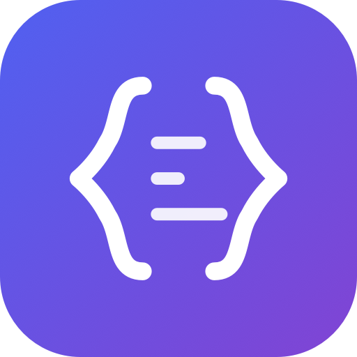
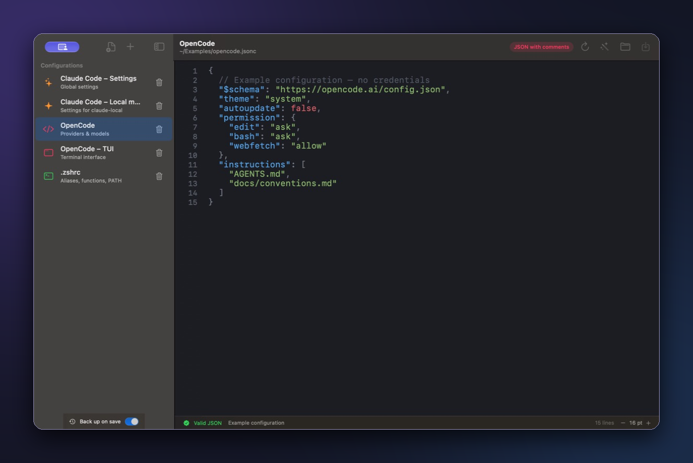

<div align="center">



# DotShelf

### Your dotfiles, within reach.

A small, native Mac app for the config files you keep coming back to.<br />
Keep them in one sidebar. Make an edit. Get back to work.

[](#get-started)
[](#why-dotshelf)
[](https://github.com/RobinBially/DotShelf/actions/workflows/ci.yml)

**[Get started](#get-started)** · **[Features](#a-little-editor-with-the-right-details)** · **[Roadmap](docs/ROADMAP.md)** · **[Feedback](https://github.com/RobinBially/DotShelf/issues)**

Built by [Robin Bially](https://github.com/RobinBially) · Part of [LocalFoundry](https://github.com/localfoundry)

</div>

<br />

[](docs/images/screenshot.png)

<p align="center"><sub>The actual DotShelf interface, in English, with example configuration files. Click for the full-size screenshot.</sub></p>

## Why DotShelf?

Your shell settings live in one hidden folder. Your AI tools keep their configs
in another. You know the change you want to make; finding the file is the tedious part.

DotShelf gives those files a permanent home in a sidebar. Open your Claude Code
settings, tweak an OpenCode config or update `.zshrc` in a focused native editor.
Add any other file you return to often, and give it an icon and color of its own.

**Everything stays on your Mac.** No account, network calls or telemetry.
Built with SwiftUI and AppKit, with no third-party runtime dependencies.

## A little editor with the right details

| | What you get |
| :--- | :--- |
| **A shelf for your configs** | Built-in entries for Claude Code, OpenCode and Zsh. Add your own files, including hidden ones, and collapse the sidebar into an icon rail. |
| **Comfortable editing** | Syntax highlighting for JSON, JSONC, YAML and shell, plus line numbers, search and adjustable text size. |
| **Instant JSON feedback** | Live syntax validation for JSON and JSONC. Format JSON in a click; formatting JSONC asks before removing comments. |
| **Control over your edits** | Save explicitly with **⌘S**. Save, discard or cancel when leaving unsaved changes. Failed saves keep your buffer intact. |
| **Careful file handling** | Preserve symlinks and existing permissions. Detect external changes before saving. Create new files with owner-only permissions. |
| **Backups by default** | Each save of an existing file creates a separate backup beside its target. |

English is the default interface language. See the [usage guide](docs/USAGE.md)
for keyboard shortcuts, default file locations and current limitations.

## Get started

> **Early preview · build from source today.** The source is public; a packaged,
> notarized download and Homebrew installation are still being prepared.

Requires **macOS 14 Sonoma or later** and **Xcode 26.3 or newer** to build.
The app supports Apple Silicon and Intel Macs.

```sh
git clone https://github.com/RobinBially/DotShelf.git
cd DotShelf
./build-app.sh
open ~/Applications/DotShelf.app
```

Select your full Xcode installation as the active developer directory if needed.
The build script installs a locally signed app in `~/Applications`.
See [build options](docs/RELEASING.md#local-builds) for a different destination or a Universal build.

1. **Pick a file** from the sidebar, or use **+** to add an existing one.
2. **Make your change.** JSON validation updates as you type.
3. **Press ⌘S.** Backups are enabled by default.

### Homebrew — coming with the first packaged release

DotShelf will be distributed through the [LocalFoundry tap](https://github.com/localfoundry/homebrew-tap).
The cask is **not available yet**. The [release guide](docs/RELEASING.md)
tracks the signing, notarization and publication process.

## What's next?

The next useful additions are **backup history with restore**, a **diff for external
changes**, **TOML support** and **Quick Open with ⌘P**. The [roadmap](docs/ROADMAP.md)
explains the ideas and their status.

Have a config workflow DotShelf could make easier?
[Open an issue](https://github.com/RobinBially/DotShelf/issues) with your use case.
Bug reports and focused pull requests are welcome.

## Under the hood

SwiftUI provides the app and sidebar; AppKit powers the text editor. English
strings live in localization resources. Regression tests cover JSON parsing,
file safety, unsaved changes, lifecycle handling and localization.

```sh
swift test
python3 scripts/check-localization.py
```

Tests require full Xcode. GitHub Actions runs the tests and builds an app artifact.
A separate manual workflow prepares a signed, notarized **draft release** once
Apple credentials are configured.

[Contributor guide](docs/CONTRIBUTING.md) · [Build & release guide](docs/RELEASING.md) · [Release review](docs/REVIEW.md)

## License

No open-source license has been selected yet.
