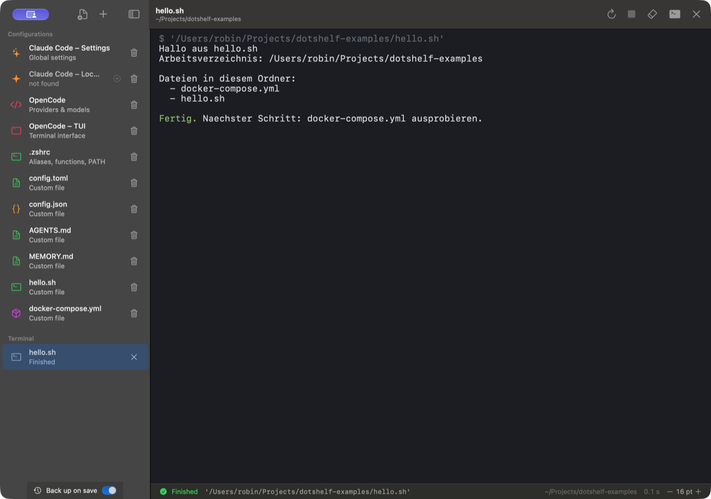

<div align="center">


# DotShelf

### Your dotfiles, within reach.

A small, native Mac app for the config files you keep coming back to.<br />
Keep them in one sidebar. Make an edit. Get back to work.

[](#get-started)
[](#why-dotshelf)
[](https://github.com/robin-bially/DotShelf/releases/latest)

**[Get started](#get-started)** · **[Features](#a-little-editor-with-the-right-details)** · **[Roadmap](docs/ROADMAP.md)** · **[Feedback](https://github.com/robin-bially/DotShelf/issues)**

Built by [Robin Bially](https://github.com/robin-bially).

</div>

<br />

[](docs/images/screenshot.png)

<p align="center"><sub>The actual DotShelf interface, in English, with example configuration files. Click for the full-size screenshot.</sub></p>

## Why DotShelf?

Your shell settings live in one hidden folder. Your AI tools keep their configs
in another. You know the change you want to make; finding the file is the tedious part.

DotShelf gives those files a permanent home in a sidebar. Open your Claude Code
settings, tweak an OpenCode config or update `.zshrc` in a focused native editor.
Add any other file you return to often, and give it an icon and color of its own.
When a project comes with a script – a `docker compose` stack, a setup script –
DotShelf runs it right there and shows the output where you edit.

**Everything stays on your Mac.** No account, network calls or telemetry.
Built with SwiftUI and AppKit, with no third-party runtime dependencies.

## A little editor with the right details

| | What you get |
| :--- | :--- |
| **A shelf for your configs** | Built-in entries for Claude Code, OpenCode and Zsh. Add your own files, including hidden ones, and collapse the sidebar into an icon rail. |
| **Comfortable editing** | Syntax highlighting for JSON, JSONC, YAML and shell, plus line numbers, search and adjustable text size. |
| **Instant JSON feedback** | Live syntax validation for JSON and JSONC. Format JSON in a click; formatting JSONC asks before removing comments. |
| **Run scripts where you edit them** | Start a shell script or a `docker compose` stack with **⌃R** or the green play button – it runs right away, options only when you ask for them (**⌥⌃R**). A temporary terminal entry appears in the sidebar and its output opens in the editor, with input, stop, rerun and clear. |
| **Control over your edits** | Save explicitly with **⌘S**. Save, discard or cancel when leaving unsaved changes. Failed saves keep your buffer intact. |
| **Careful file handling** | Preserve symlinks and existing permissions. Detect external changes before saving. Create new files with owner-only permissions. |
| **Backups by default** | Each save of an existing file creates a separate backup beside its target. |

English is the default interface language. See the [usage guide](docs/USAGE.md)
for keyboard shortcuts, default file locations and current limitations.

## Run scripts where you edit them

[](docs/images/terminal.png)

Select a shell script or a `docker compose` file and press **⌃R** – or click the
green play button. The command starts right away; a temporary entry appears in
the sidebar's **Terminal** section and its output opens in the editor. Scripts and
compose files carry their own icon, so you can tell at a glance what runs where.

The terminal is a real one: type into a running process, press **⌃C** to stop it,
**⌘V** to paste. A shell that waits at its prompt reads **Ready** – the spinner
only shows while something actually works. DotShelf asks before closing only when
a process is still running, and a finished script can hand over to a free login
shell in the same folder. Options (command, working directory, name) are there
when you want them: **⌥⌃R** or the menu next to the play button.

## Get started

Requires **macOS 14 Sonoma or later**. The Universal app runs on
**Apple Silicon and Intel Macs**, is signed with Developer ID and notarized by Apple.

### Homebrew

```sh
brew install --cask robin-bially/tap/dotshelf
```

Homebrew downloads the verified release from this repository through the
[Homebrew tap](https://github.com/robin-bially/homebrew-tap).
To update later, run `brew update && brew upgrade --cask dotshelf`.

### Direct download

**[Download DotShelf for Mac](https://github.com/robin-bially/DotShelf/releases/latest)**

Unzip the download, drag **DotShelf.app** into **Applications**, and open it.
See the [release notes](https://github.com/robin-bially/DotShelf/releases/latest)
for changes and the SHA-256 checksum.

> **Early preview:** DotShelf is ready to try, with more improvements planned.
> See the [current limitations](docs/USAGE.md#current-limitations) and share feedback through Issues.

### Your first edit

1. **Pick a file** from the sidebar, or use **+** to add an existing one.
2. **Make your change.** JSON validation updates as you type.
3. **Press ⌘S.** Backups are enabled by default.

<details>
<summary><strong>Build from source</strong></summary>

Requires **Xcode 26.3 or newer**. Select your full Xcode installation as the active
developer directory, then run:

```sh
git clone https://github.com/robin-bially/DotShelf.git
cd DotShelf
./build-app.sh
open ~/Applications/DotShelf.app
```

The build script installs a locally signed app in `~/Applications`.
See [build options](docs/RELEASING.md#local-builds) for a different destination or a Universal build.

</details>

## What's next?

The next useful additions are **backup history with restore**, a **diff for external
changes**, **TOML support** and **Quick Open with ⌘P**. The [roadmap](docs/ROADMAP.md)
explains the ideas and their status.

Have a config workflow DotShelf could make easier?
[Open an issue](https://github.com/robin-bially/DotShelf/issues) with your use case.
Bug reports and focused pull requests are welcome.

## Under the hood

SwiftUI provides the app and sidebar; AppKit powers the text editor. English
strings live in localization resources. Regression tests cover JSON parsing,
file safety, unsaved changes, lifecycle handling, localization and the script
runner (real PTY, input, stopping).

```sh
swift test
python3 scripts/check-localization.py
```

Tests require full Xcode. Releases are built, tested, notarized and published
locally with the shared release driver; see the [build & release guide](docs/RELEASING.md).

[Contributor guide](docs/CONTRIBUTING.md) · [Build & release guide](docs/RELEASING.md) · [Release review](docs/REVIEW.md)

## License

No open-source license has been selected yet.
